# **School District Analysis**

## **1. Overview of the School District Analysis**

Maria, the Chief Data Scientist for a city school district has been tasked with aggregating and analyzing all standardized test data to assist the school board and the superintendent in making decisions regarding the school budgets and priorities.  After finalizing the analysis, it has been discovered that there was evidence of academic dishonesty in Thomas High School's ninth-grade test scores.  

We were tasked with re-running the school district analysis to account for this issue.  In order to keep the data intact, we replaced the Thomas High School ninth-grade math and reading scores with NaNs instead of removing the entire ninth-grade data or replacing them with a zero value.  

We worked with the following **resources** to generate the results:
- **Data Source**: schools_complete.csv and students_complete.csv
- **Software**: Python 3.7.6, Jupyter Notebook

*Note: The use of the data sources in this report adheres to the Family Educational Rights and Privacy Act (FERPA). https://www2.ed.gov/policy/gen/guid/fpco/ferpa/index.html*  

## **2. School District Analysis Results**
- Affect on the district summary: 
    - The overall affect to the district summary is almost negligible.  In the case of average reading scores, the affect is so small that when rounded to the tenths of a grade point, there appears to be no affect at all.  
    - In the case of grade passing percentages there is a slight difference when shown to the tenth of a percentage. However, grade percentages are typically formatted to the whole percentage so when following this standard there seems to be no affect at all.

        - Original district summary
            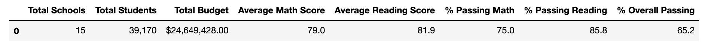

        - Updated district summary
            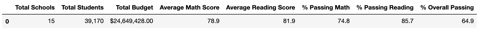

- Affect on the school summary:
    - As shown in the DataFrame examples below, the grade passing percentages for Thomas High School fell drastically when the ninth-grade scores were replaced with NaNs.  This was due to the fact that though 28% of the Thomas High School's grades were now NaNs, we were still factoring in the total number of students at the high school.

        - Original school summary
            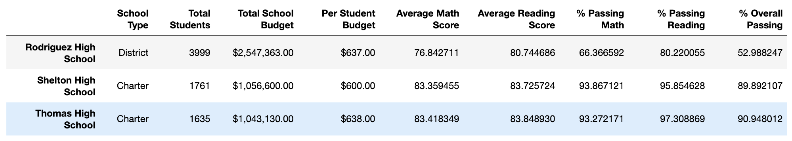

        - Updated school summary
            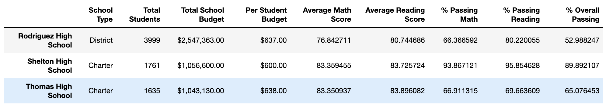
    - When we corrected for this by only counting tenth to twelfth-graders in the student count for Thomas High School, the affect on the school summary became almost negligible and basically non-existent when rounded to the whole percentage.

        - Replaced grade percentage school summary
            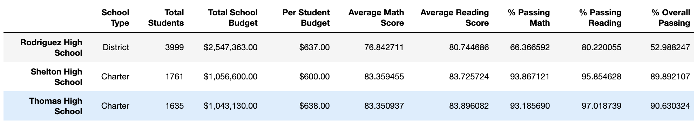

- Affect on Thomas High School's performance relative to the other schools after replacing the ninth-graders' math and reading scores:
    - There was no affect on Thomas High School's performance relative to other schools.  Thomas High School in both scenarios ranked second based on overall passing percentage.

        - Original top five performing schools
            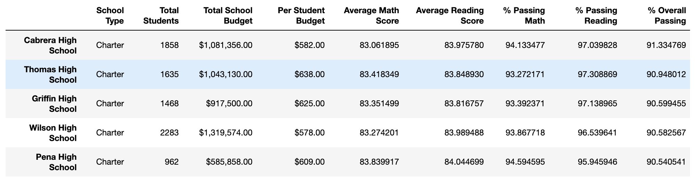

        - Updated top five performing schools
            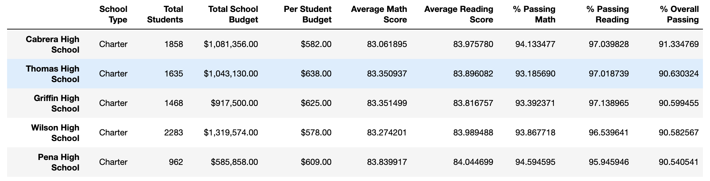
    
- Affects of replacing the ninth-grade scores on the following:
    - Math scores, specifically for the ninth-grade for Thomas High School was affected as no grades were reported in the updated analysis.

        - Original math scores
            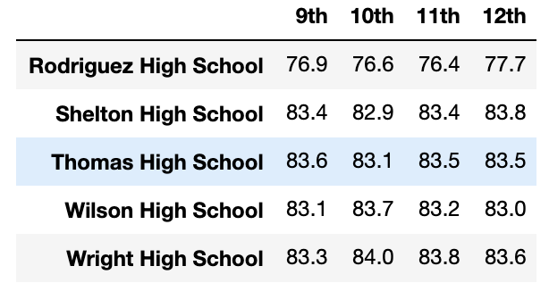

        - Updated math scores
            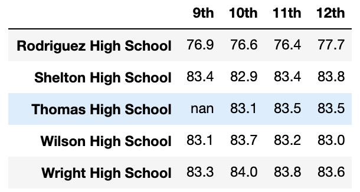
    
    - Similarly, reading scores by grade were affected for Thomas High School due to no grades being reported in the new analysis for the ninth-grade.

        - Original reading scores
            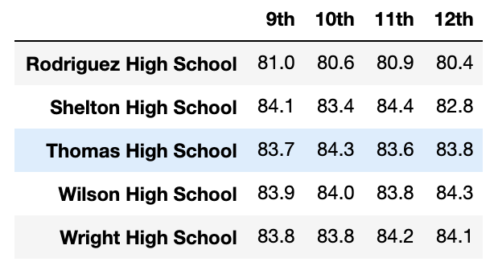

        - Updated reading scores
            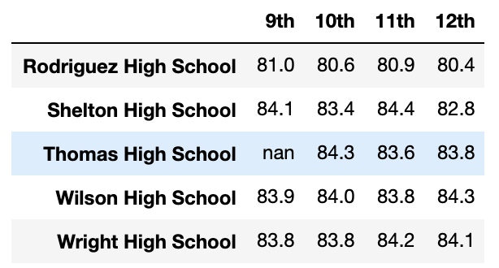

    - Thomas High School falls within the $630-644 spending range per student.  Comparing the data in this spending bin, we can see that there was no affect in the grade scores or passing percentages once the numbers were rounded.

        - Original scores by school spending
            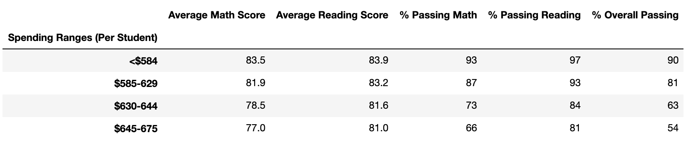

        - Updated scores by school spending
            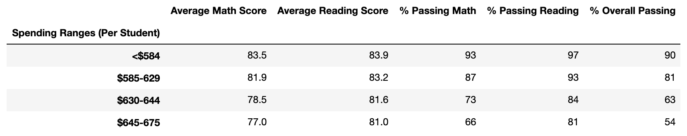

    - Thomas High School falls within the medium school size range.  Again, the difference was so small that with rounding, there was no affect to any of the scores or grade percentages per school size.

        - Original scores by school size
            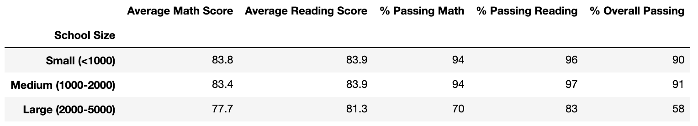

        - Updated scores by school size
            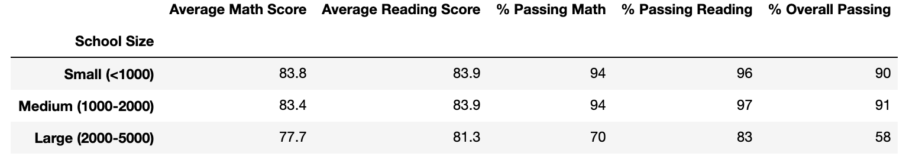

    - Thomas High School is a charter school.  Again, replacing the ninth-grade scores to NaN had no affect on scores by school type when numbers were rounded.

        - Original scores by school type
            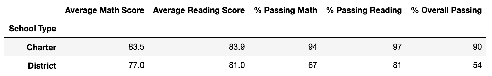

        - Updated scores by school type
            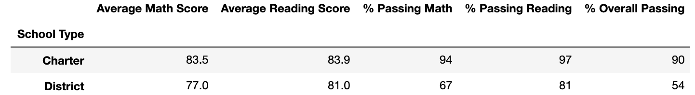

## **3. School District Analysis Summary**

In this project, we were tasked with repeating the school district analysis after replacing the Thomas High School ninth-grade test scores with NaNs.  

Overall, the affects on the final results were very slight and/or negligible as the number of students affected were only 1.2% of the total students.  However, there were some major changes in the updated school district analysis which are outlined below.  

1) In the school summary, a major change we made was removing the Thomas High School ninth-grade students from the total count to calculate its grade passing percentages.  We achieved this by getting the number of passing students from the tenth to twelfth-grade from Thomas High School and adding up the total. 

    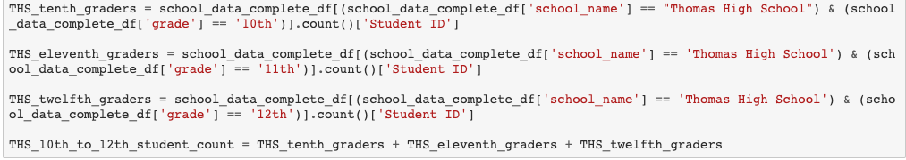

2) With the new student count for Thomas High School, another change we made was to replace the grade passing percentages with the new percentages utilizing the DataFrame.loc[] formula.  If we did not make this update, Thomas High School would have landed in the bottom ten lowest-performing schools instead of in the top five performing schools.

    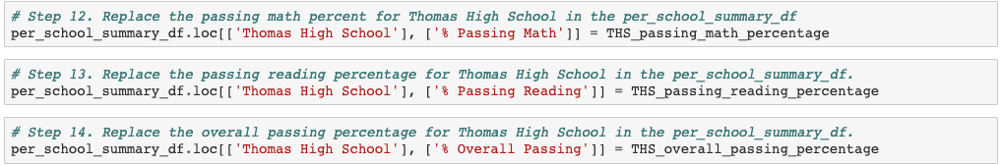

3) When summarizing math and reading scores by grade by schools, we made a change in the data for Thomas High School by replacing the ninth-grade scores with NaN.  Though overall the impact was small, if we wanted to do a comparison analysis specifically for the ninth-grade, we would not be able to factor Thomas High School into the analysis.

4) Overall there wasn't a great impact on the final results when Thomas High School ninth-grade scores were updated to NaN but at the school level the change did affect 28% of the student population so the results for Thomas High School can be skewed if we did not correct for this.